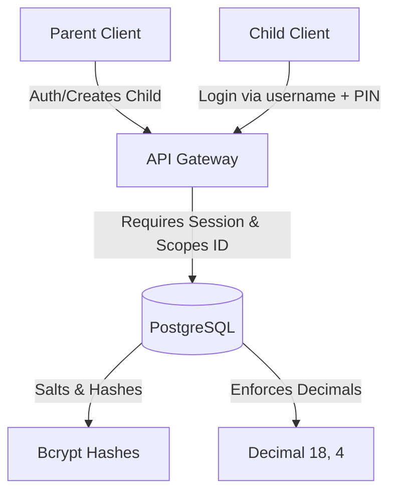

# Data Protection & Privacy Map (Saudi PDPL Compliance)

This document maps the user and data minimization architecture of **Rushd Financial** to ensure compliance with the **Saudi Personal Data Protection Law (PDPL)** regarding minor accounts.

---

## 1. Persona Data Minimization Architecture

To protect minors (~8-17 years old), Rushd enforces a strict zero-PII data collection policy for children.

| Attribute | Parent Account | Child Account | Compliance Rationale |
| :--- | :--- | :--- | :--- |
| **Email Address** | Collected & Verified | **Not Collected** | Prevents outbound email contact, tracking, or account sharing. |
| **Phone Number** | Not Collected | **Not Collected** | Minimizes vector footprint for notifications and tracking. |
| **Username** | Email | Alphanumeric Handle (e.g. `jauharah`) | Standard handle. No real name required. |
| **Authentication** | Password (Argon2/bcrypt) | Hashed 4-6 digit PIN | Minimizes retention complexity. PIN is salted and hashed on DB. |
| **Supervision Link** | Self-Owned | Linked via `parentId` and `familyCode` | Guarantees clear parent guardianship link for auditing. |
| **Analytics/IP** | Standard server logs | **Not Tracked** | Zero behavioral profiling or ad-targeting vectors. |

---

## 2. Data Flow & Security Mapping

### Encryption & Privacy Gating
1. **Passwords & PINs:** All secrets are hashed using `bcryptjs` with standard cost factors (`BCRYPT_COST=12`) before database write. Clear text passwords or PINs are never logged.
2. **Access Scoping:** Gated via `@/lib/authz` scoping controls. Sibling accounts cannot view each other's data (403 forbidden), and parents can only fetch child rows matching their family link.
3. **Data Retention:** Family accounts can request full account deletion. On deletion, a cascading database trigger removes the parent, child logins, savings jars, XP profiles, and portfolio items.
