# ValueSnapshot stock page — feature and interaction recon

**Target inspected:** `https://valuesnapshot.io/stock/NVDA`  
**Inspection date:** 2026-07-16  
**Access level:** anonymous public session; no account or trial was created  
**Responsive check:** desktop and a 375 px document viewport (the browser's 390 px outer viewport produced 375 px of page width)

This is a behavioral and information-architecture inventory, not a visual-copy specification. Values below are point-in-time observations from the NVDA page and may change with the market or the site's data provider. Repeated metric cards are counted as one feature group in the summary; individual fields are still listed where they were visible.

The interaction audit used the site's anonymous allowance. The session began with four analyses remaining and later displayed `5/5` free analyses consumed. No registered user quota or payment state was changed.

## Shared stock-page shell

The stock experience is organized around a persistent company header followed by ten horizontal tabs. On desktop it sits beside a fixed navigation rail; on mobile the navigation becomes a compact top bar and the tabs become a horizontally scrollable rail.

### Company header and global controls

- Company identity: logo, legal/company name, ticker, sector chip, current price, session change in percent, and market capitalization.
- NVDA observation: `$212.50`, `+0.33%`, market cap `$5.15T`. Currency values use `$` and compact `B`/`T` suffixes; positive movement is green.
- Global stock search is available in the header. The mobile version keeps search as an icon rather than a full field.
- Theme switch, **Sign in**, and **Register** controls are visible without an account.
- A heart control represents the watchlist. Clicking it while signed out shows a toast requiring sign-in; it does not silently mutate local state.
- No direct **Add to portfolio** or price-alert editor was visible in the public stock shell. Watchlist is the only stock-level persistence action exposed here.
- Tabs, in order: **Overview**, **Charts**, **Financials**, **Valuation**, **Analyst**, **Compare**, **AI Analysis**, **Snapshot**, **Earnings**, and **SEC Filings**. SEC Filings opens an external SEC page.

### Shared states

- Initial navigation briefly renders the stock shell with an empty main region before the tab content resolves. There was no strong content-shaped skeleton in the observed state.
- An invalid ticker retains the shell and renders: “Unable to load this ticker. Try another symbol.” There is no inline retry button.
- Premium sections use three patterns: a blurred/pointer-blocked surface with a central CTA, an opaque lock card in front of an iframe, or a usage-counter dialog.
- Sign-in-gated controls such as watchlist, saved research notes, and model history explain the requirement rather than failing silently.

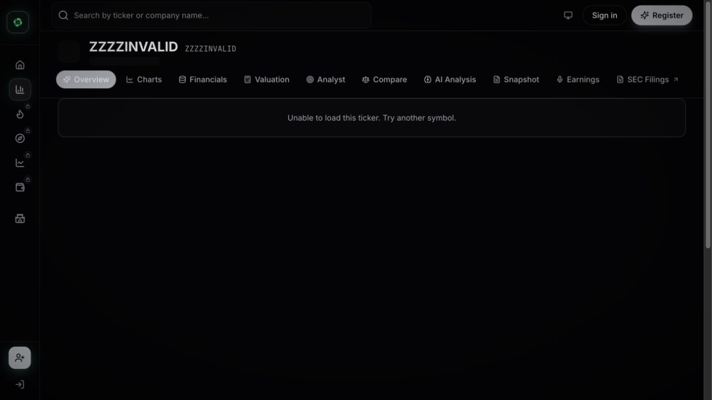

### Mobile behavior

- The company identity compresses into a short strip beneath the top bar.
- Tabs remain in their desktop order and scroll horizontally.
- Multi-column content stacks to one column; chart cards resize to the viewport.
- The inspected document had `clientWidth = 375` and `scrollWidth = 375`, so the page itself did not introduce horizontal overflow. The tab rail intentionally scrolls within its own bounds.
- Desktop sidebar actions move behind the mobile menu.

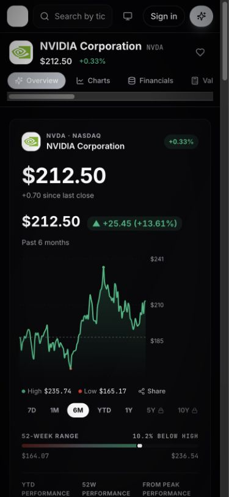

## Overview

### 1. Price history

- Line/area price chart with current price, current daily move, selected-period absolute and percentage return, selected date, period high, and period low.
- Public range buttons: **7D**, **1M**, **6M**, **YTD**, and **1Y**. **5Y** and **10Y** show locks; clicking 5Y navigated to `/checkout?plan=annual`.
- The default observed range was 6M. Selecting 1M changed the header to “Past month” and recalculated the return to `+$5.09 / +2.45%`, high `$212.50`, and low `$192.53`.
- Hover adds a vertical crosshair and point marker. The headline price, selected-period gain, and date all follow the hovered point; for example, one hover showed May 11, 2026 at `$219.44`, `+$32.39 / +17.32%`.
- Beneath the chart, a 52-week range shows low/high endpoints (`$164.07` and `$236.54`) and distance from the high (`10.2% below high`).
- Compact performance facts: YTD `+12.52%`, 52-week `+24.00%`, and from peak `-10.16%`.

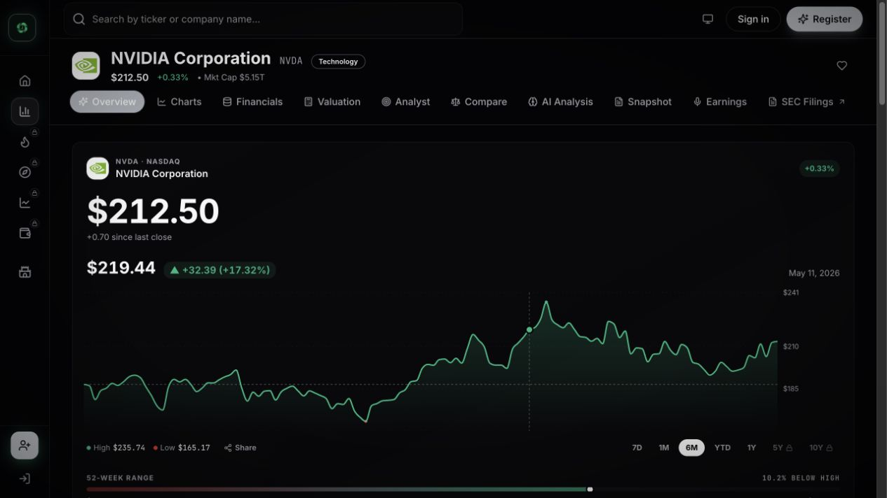

### 2. Automated verdict

- A short qualitative assessment combines business quality with valuation.
- The observed state classified the company as high quality and approximately 33% below the site's fair value.
- This section is a conclusion card rather than an editable model; the supporting valuation and financial cards follow immediately below.

### 3. Valuation snapshot

- Three dollar values: **Current Price** (`$212.50`), **Fair Value** (`$317.63`), and **High Estimate** (`$365.27`).
- Horizontal valuation band divided into under/fair/over zones.
- Derived fields: **Upside** (`+49.5%`) and **Margin of Safety** (`+33.1%`).
- A semantic verdict chip summarizes the margin-of-safety state.

### 4. Key financials

Cards use a label, compact value, and in some cases a qualitative chip:

| Field | Observed format/value |
| --- | --- |
| Revenue Growth TTM | percent, `65.5%` |
| Gross Margin | percent, `74.1%` |
| Operating Margin | percent, `64.0%` |
| FCF Margin | percent, `47.0%` |
| FCF TTM | compact currency, `$119.1B` |
| Balance Sheet | qualitative chip, `Fortress` |
| P/E TTM | multiple, `32.2x` |
| Forward P/E 2Y | multiple, `16.8x` |
| EPS Growth TTM | percent, `66.0%` |
| PEG | multiple, `0.49x` |

### 5. Linked financial mini-charts

- **Revenue Growth:** annual six-year bar/line presentation; latest fiscal-year revenue `$215.9B`, YoY `+65.5%`, five-year CAGR `+66.9%`.
- **Free Cash Flow:** annual six-year history; TTM `$119.1B`, margin `47.0%`, YoY `+58.9%`.
- **Margin Profile:** five-year multi-series margin view; gross, operating, net, and FCF margin with current level and change in percentage points.
- **Earnings Power:** five-year diluted-EPS view; TTM EPS `$6.59`, YoY `+66.1%`, five-year CAGR `+94.8%`, and forward growth `+66%`.
- Cards link into the deeper chart/financial experiences rather than behaving as editable widgets.

### 6. Bull and bear cases

- Two parallel lists summarize supportive and adverse considerations.
- Bull themes observed: demand, competitive moat, operating leverage, and capital position.
- Bear themes observed: valuation sensitivity and competition.
- The UI keeps evidence framing separate from the one-line verdict; it does not hide the downside case.

### 7. Opportunity Matrix

- Four user-rated dimensions: **Business Quality**, **Financial Strength**, **Valuation**, and **Long-Term Tailwinds**.
- Each dimension has a three-state segmented control: weak, neutral, strong.
- Initial overall status was “Not yet rated.” Selecting strong for all four updated the aggregate to “Strong Opportunity.”
- Selections behaved as local interactive state in the anonymous session; no durable-save claim was made.

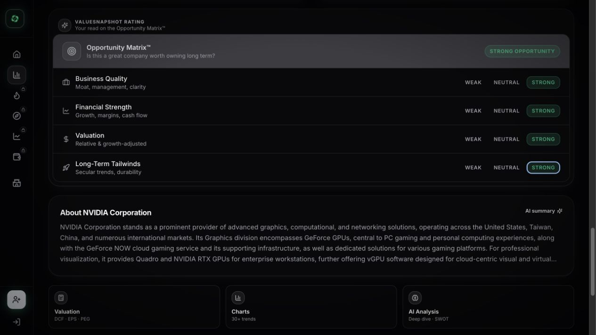

### 8. Company profile and onward links

- About-company summary appears near the bottom.
- Contextual links route to the AI summary, Valuation, Charts, and AI Analysis experiences.
- The page uses these links to move from a decision summary into progressively deeper evidence.

## Charts

### 1. Chart-library header

- Company/ticker identity, **Chart Builder**, and chart search.
- Frequency control: **Annual**, **Quarterly**, **TTM**.
- Range control: **3Y**, **5Y**, **10Y**, **Max**, **Custom**.
- Default annual range label observed: `2017–2026`, with 10Y selected.
- Switching to Quarterly changed the range to `2024 Q1–2026 Q2`; the 10Y control stayed visually selected but became disabled.

### 2. Category rail

- **Show All**.
- **Essentials** — 9 charts.
- **Profitability** — 18 charts.
- **Cash Flow** — 7 charts.
- **Balance Sheet** — 14 charts.
- **Valuation** — 11 charts.
- **Segments** and **Company KPIs** are present without a visible count in the inspected shell.

### 3. Essential chart cards

The default grid contained:

- Revenue `$215.94B`
- EPS `$4.93`
- Free Cash Flow `$96.68B`
- Gross Margin `71.1%`
- Operating Margin `60.4%`
- Gross Profit `$153.46B`
- Operating Income `$130.39B`
- Revenue per Share `$8.86`
- Shares Outstanding `24.36B`

Each card combines a headline value with its own historical chart. Hover exposes period, value, and growth where applicable; one example showed 2025 Revenue `$130.50B` and `+114.2%` YoY.

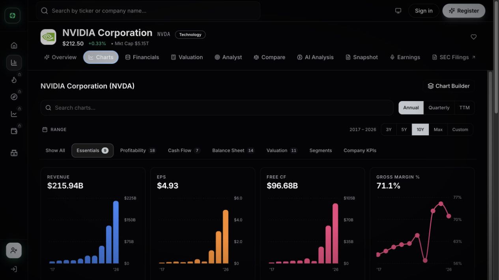

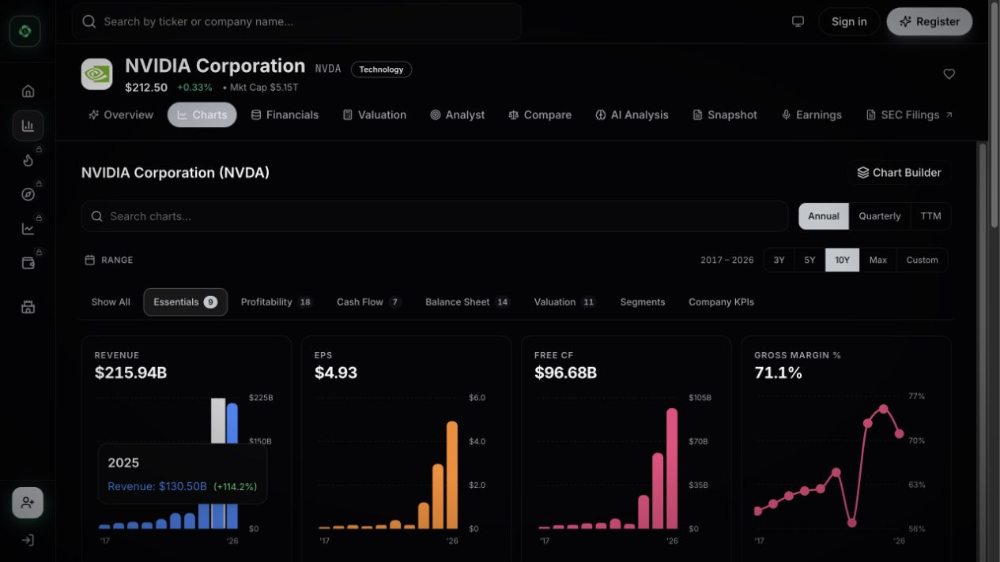

### 4. Profitability category

The category switch replaced the grid with 18 profitability entries. Visible labels included Net Income, EPS, Gross Margin, Operating Margin, Net Margin, FCF Margin, Gross Profit, Operating Income, EBITDA, ROIC, ROE, ROA, Operating Expenses, R&D Expenses, SG&A Expenses, and EBITDA Margin. The rendered DOM exposed repeated ROIC/ROE/ROA entries, an implementation detail worth checking before treating 18 as 18 unique concepts.

### 5. Card actions and explanations

- **Pin** action on each chart.
- **About** opens an educational modal with definition, calculation, interpretation, and usage tips.
- **Expand** opens a large modal with frequency controls, About, chart options, series color, export theme, PNG download, and copy-to-clipboard.
- Expanded summary fields: current value, YoY change, three-year average growth, CAGR, full period, period high, period low, and data source. The observed source label was Financial Modeling Prep.

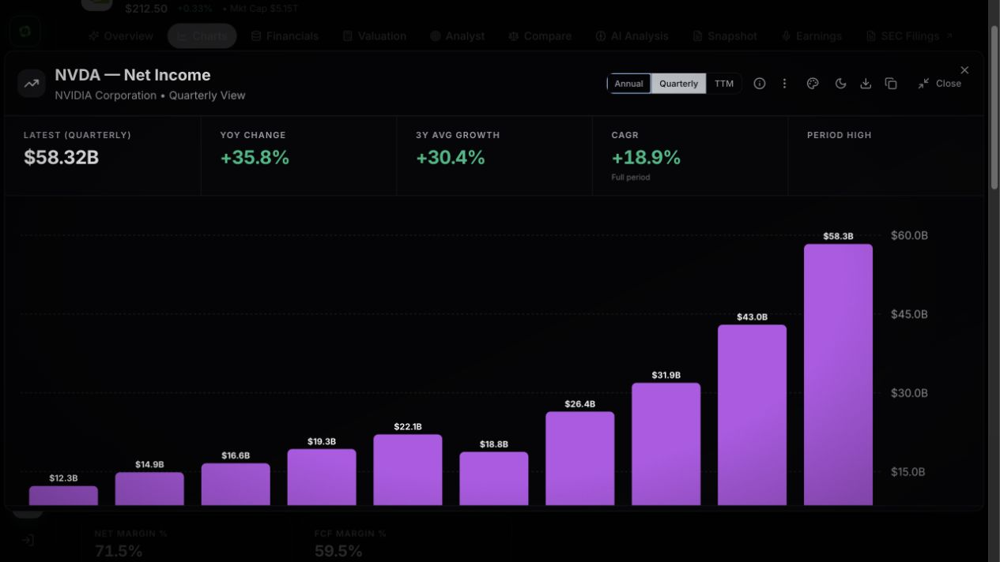

### 6. Chart Builder

- Opens inline rather than navigating away.
- Provides period buttons, Copy, Download, Save, series color fields, comparison ticker search, **Add Ticker**, and **Add Metrics** with a `2/10` selection count.
- Presets observed: Revenue vs Income, Revenue + Margins, Cash Flow, Profitability, Per Share, Returns, Revenue + Projections, EPS + Projections, Price vs EPS, Price vs FCF/Share, Price vs Margins, and Price vs Revenue + Net Income.
- The public session could inspect the builder structure, but a lock overlay blocked full use and promoted the trial for mixed metrics, chart types, palettes, and export.

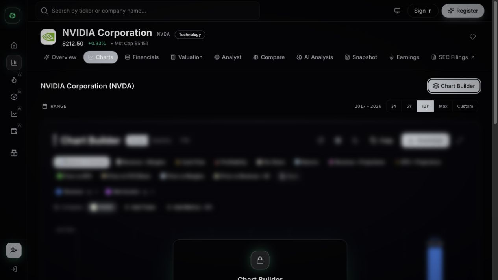

### 7. Premium boundary

- The public grid exposes a selected chart subset.
- A bottom CTA offers access to 30+ advanced charts.
- Builder composition/export is locked even though its underlying controls are visible.

## Financials

### 1. Quick Insights

Twelve compact cards summarize the latest annual period (2026):

| Field | Observed value/subtext |
| --- | --- |
| Revenue | `$215.9B`, `+65.5% YoY` |
| Revenue CAGR | `+30.7%`, 27 years |
| Net Income | `$120.1B`, `+64.7%` |
| Free Cash Flow | `$96.7B`, `+58.9%` |
| Gross Margin | `71.1%`, `+36.3% vs start` |
| Operating Margin | `60.4%`, `+57.5% vs start` |
| Net Margin | `55.6%`, `+53% vs start` |
| FCF Margin | `44.8% of revenue` |
| EPS | `$4.93`, `+66.1%` |
| ROE | `76.3%` |
| Debt / Equity | `0.05`, low-leverage descriptor |
| Net Cash | `$2.1B` |

- A **Share Image** action is available for this summary.

### 2. Statement controls

- Frequency: **Annual** and **Quarterly**.
- Statement type: **Income**, **Balance Sheet**, **Cash Flow**.
- Display unit is millions; annual columns ran from 2026 back to 1999 (28 years).
- Values use compact `$B`/`$M`/`%` formatting with growth text color-coding.

### 3. Income-statement field inventory

Visible row labels beneath the lock were Revenue, Cost of Revenue, Gross Profit, Gross Margin, Operating Expenses, R&D Expenses, SG&A Expenses, D&A, Operating Income, Operating Margin, Interest Expense, Income Before Tax, Income Tax, Effective Tax Rate, EBITDA, Net Income, Net Margin, EPS Basic, EPS Diluted, Shares Outstanding, and Diluted Shares.

### 4. Premium boundary

- Full income, balance-sheet, and cash-flow histories are blurred and pointer-blocked.
- A centered CTA covers the table and offers a trial for 30+ years of statements.
- Because the overlay blocks pointer events, the Balance Sheet and Cash Flow row inventories could not be verified without a trial. They are intentionally not inferred here.

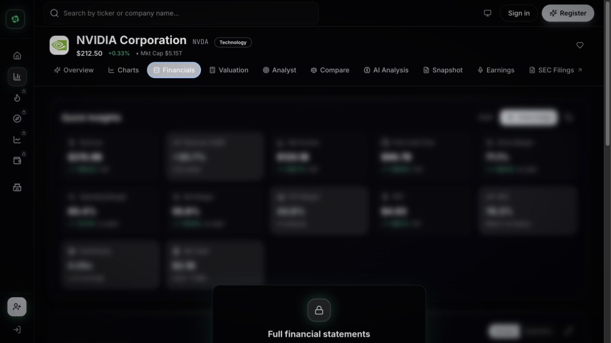

## Valuation

This is the deepest public workflow. It combines four distinct models, model-specific editable assumptions, sensitivity analysis, historical price context, peer comparison, and an aggregate verdict.

### 1. Model selector and aggregate view

Models:

1. **DCF / Cash Flow** — intended for stable, profitable companies.
2. **EPS / Earnings** — intended for profitable growth companies.
3. **Rule of 40** — growth-plus-margin quality test for technology/SaaS.
4. **PEG Ratio** — P/E relative to growth.

Global actions: **Compare All 4**, **Save All**, model-snapshot share, stock search/clear, model enable switches, and **Adjust Workspace**.

Historical reference chips include one-, three-, and five-year revenue growth, FCF margin, current P/E, and average historical P/E.

The aggregate screen showed:

| Model | Primary output | Observed classification |
| --- | --- | --- |
| DCF | intrinsic value `$437.48`, upside `106%` | bullish |
| EPS | fair value `$399.60`, upside `88%` | bullish |
| Rule of 40 | score `88` | exceptional |
| PEG | `1.28` | fair value |

- All four enabled models fed the synthesis.
- The overall result was **Strong Buy**, with `6 bullish / 0 bearish` evidence counts and average upside near `+97%`.
- The AI synthesis presents short key-insight themes; detailed generated prose was not copied.
- The public meter initially reported four free analyses remaining.

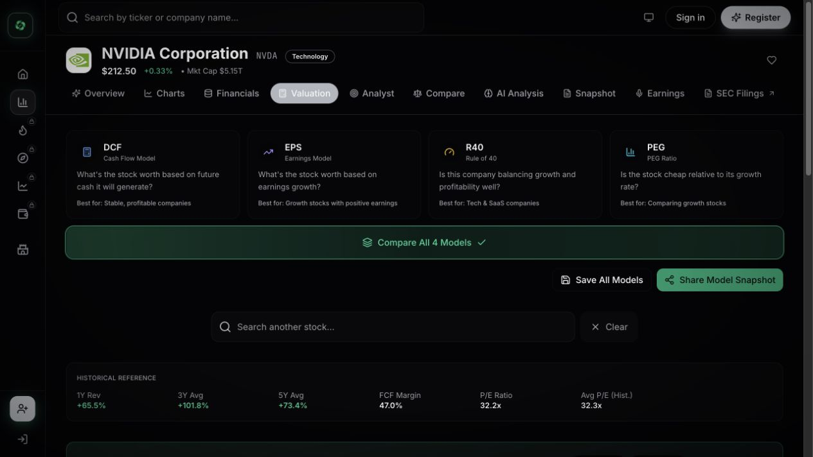

### 2. DCF model

**Outputs**

- Verdict: undervalued.
- Current price `$212.50`; intrinsic value `$437.48`; five-year target `$645.49`; implied CAGR `24.9%`.
- Assumption summary: revenue growth `25%`, FCF margin `47%`, terminal multiple `43x`, forecast length `5` years.

**Editable inputs**

| Input | Control/range | Reference shortcuts |
| --- | --- | --- |
| Forecast years | textbox + slider, 1–20; default 5 | none |
| TTM Revenue | currency textbox + slider, roughly 0.5×–5× current; `$253.491B` observed | current data |
| Revenue Growth | percent textbox + slider, 0–300; default 25 | estimate 55; 1Y 65.5; 3Y 101.8; 5Y 73.4 |
| FCF Margin | percent textbox + slider, 0–100; default 47 | TTM 47; 1Y 59.5; 3Y 49.9; 5Y 47.6 |
| Terminal Multiple | multiple textbox + slider, 1–100; default 43 | current P/FCF 43; five-year average P/E 32 |
| Discount Rate | percent textbox + slider, 0–30; default 10 | market reference 8–12 |

- Quick presets: conservative, moderate, aggressive. Selecting conservative changed the live assumptions to approximately `7.5%` growth, `12.5%` FCF margin, `10x` terminal multiple, and `13.5%` discount rate; charts and sensitivity cells recalculated.
- Projection view: revenue, FCF, and margin chart plus a yearly table with discounted values.
- Sensitivity: clickable 5×5 matrix of revenue growth versus terminal multiple; each cell shows fair value/upside and uses under/fair/over color semantics.
- Historical chart: price versus the user's fair value, with 1M through 5Y ranges.
- Research notes and saved history require sign-in.
- Quick Compare starts at `1/4`, exposes Price, P/E, FCF %, and Growth, and offers AAPL, MSFT, GOOGL, and AMZN shortcuts.

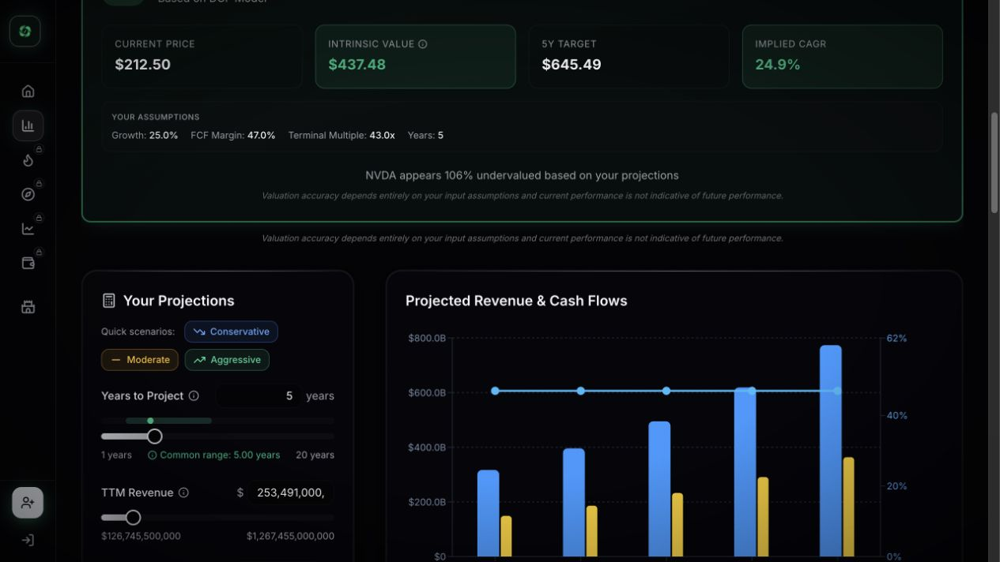

### 3. EPS model

**Outputs**

- Verdict: undervalued.
- Current price `$212.50`; fair value `$399.58`; five-year value `$643.52`; CAGR `24.8%`.
- Summary assumptions: EPS growth `25%`, P/E `32x`, forecast length `5` years.
- Current/future EPS comparison: `$6.59` to `$20.11`, approximately `205%` growth.

**Editable inputs**

| Input | Control/range | Reference shortcuts |
| --- | --- | --- |
| Current EPS | textbox + slider, 0–100; default 6.59 | Wall Street average 8.98, high 12.13, low 8.09 |
| EPS Growth | percent textbox + slider, -50–300; default 25 | TTM EPS 66; revenue 1Y 65.5, 3Y 101.8, 5Y 73.4 |
| P/E Multiple | textbox + slider, 0–100; default 32 | current 32.2, historical 32.3 |
| Forecast Years | textbox + slider, 1–20 | none |

- Projection chart and annual breakdown; each year exposes an editable growth spinbutton.
- Clickable 5×5 sensitivity matrix of growth versus P/E.
- Same price-history, notes/history, share/save, and `1/4` peer comparison modules as DCF.

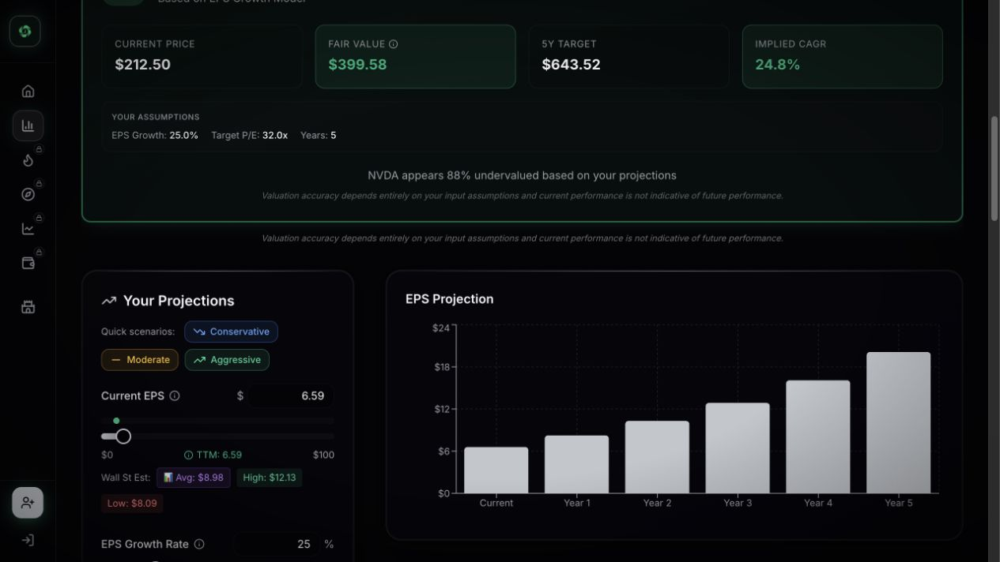

### 4. Rule of 40 model

**Outputs and interpretation**

- Score `88`, classified **Exceptional**, and above the `40` target.
- Calculation is visible as revenue growth `25` plus net margin `63`.
- Reference scale: weak below 20, moderate 20–40, healthy 40–60, exceptional 60+.

**Editable inputs**

| Input | Control/range | Reference shortcuts |
| --- | --- | --- |
| Revenue Growth | textbox + slider, -50–300 | 1Y 65.5, 3Y 101.8, 5Y 73.4 |
| Net Profit Margin | textbox + slider, -100–100 | TTM FCF 47; 1Y net 71.5; 3Y net 63.5 |

- The combined score and classification update live.
- Same historical-price, notes/history, share/copy, and quick-peer modules as the other models.

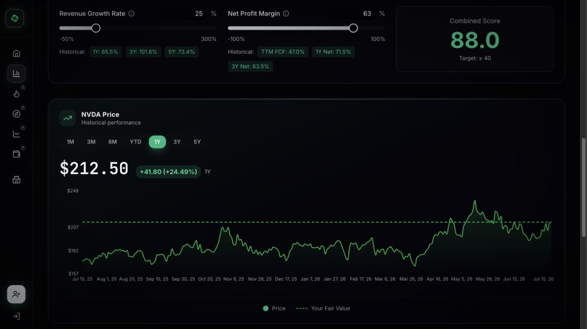

### 5. PEG model

**Outputs and interpretation**

- PEG `1.28`, classified **Fair Value**.
- Implied price at PEG = 1: `$164.75`, or `-22.5%` versus the observed market price.
- Formula is shown as P/E `32` divided by growth `25`.
- Reference bands: under 1 undervalued, 1–1.5 fair, over 1.5 overvalued.

**Editable inputs**

| Input | Control/range | Reference shortcuts |
| --- | --- | --- |
| P/E | textbox + slider, 0–200 | current 32.2, historical 32.3 |
| EPS Growth | textbox + slider, 0–300 | TTM 66 plus historical revenue-growth chips |

- Same price/history, research, share/copy, and quick-peer modules as the other models.

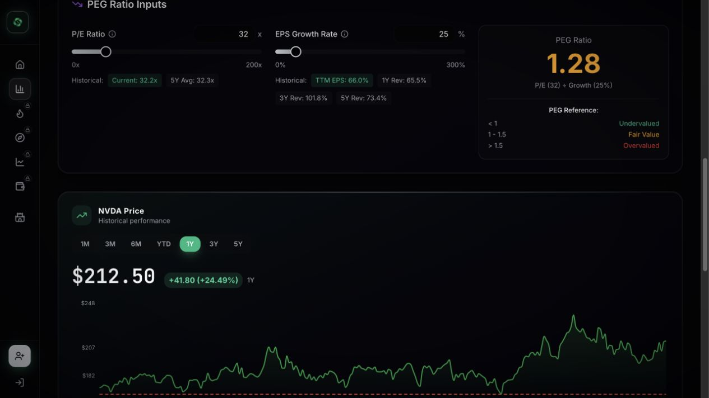

### 6. Persistence and premium boundaries

- Saved models, model history, and research notes require sign-in.
- Anonymous use is metered. The meter is tied to analysis use rather than merely viewing the shell.
- A free-versus-paid matrix later surfaced in Snapshot and described five free uses across several analysis categories; unlimited use is trial/subscription gated.

## Analyst

### 1. Price-target range

- Current-price marker and low, consensus, and high target markers on a horizontal range.
- Upside/downside is expressed in percentages under bear, consensus, and bull cases.
- The observed display included current price near `$218`, consensus target near `$500`, and scenario moves of roughly `+3%`, `+49%`, and `+135%`. The page's DOM ordering of target labels and values was ambiguous, so this inventory does not assign the remaining dollar values more precisely.
- An explanation control describes how the target range should be read.

### 2. Forward estimates

- **Annual / Quarterly** segmented control.
- Revenue consensus with YoY or QoQ growth.
- EPS average, high, and low estimates with YoY or QoQ growth.
- Legend separates estimate series. Switching to Quarterly changed growth labeling from YoY to QoQ.

### 3. Rating distribution

- Overall rating: `Buy · 79` analysts.
- Distribution: Strong Buy `2 / 3%`, Buy `58 / 73%`, Hold `16 / 20%`, Sell `3 / 4%`, Strong Sell `0`.
- Counts and percentages are shown together, avoiding a chart without denominators.

### 4. Recent price-target changes

- Repeated cards contain firm, date, short headline, new target, change versus prior target or stock price, and share action.
- Firms observed included KeyBanc, Tigress, Truist, Wedbush, Argus, Goldman Sachs, UBS, Baird, Evercore, and Needham.

### 5. Recent analyst actions

- Repeated cards contain firm, action type, date, rating, and share action.
- Observed action was commonly “maintain.” Firms included KeyBanc, Needham, DA Davidson, Tigress, Jefferies, Baird, Truist, JPMorgan, Stifel, and Wedbush.

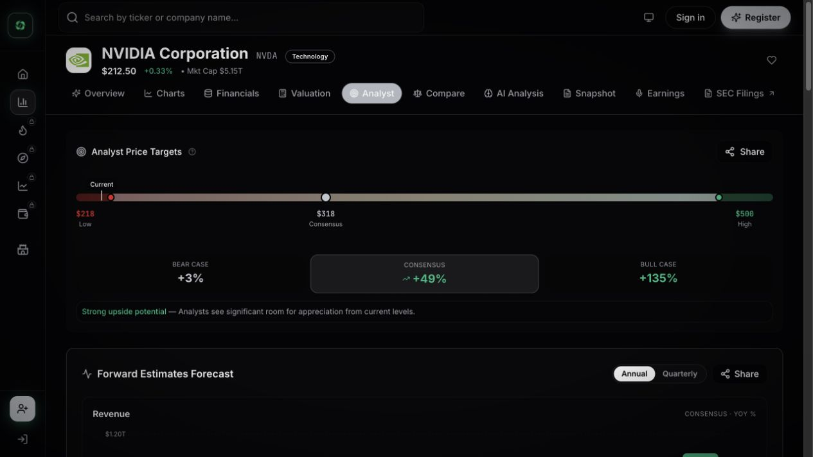

## Compare

### 1. Peer slots and add flow

- Starts with NVDA and supports up to three peers.
- **Add peer** opens live symbol search; typing `AAPL` returned Apple plus similarly prefixed leveraged/fund symbols.
- Adding is deliberately two-step: choose a search result, then click **Add**.
- Each peer column has a remove control. A share action appears once a comparison exists.

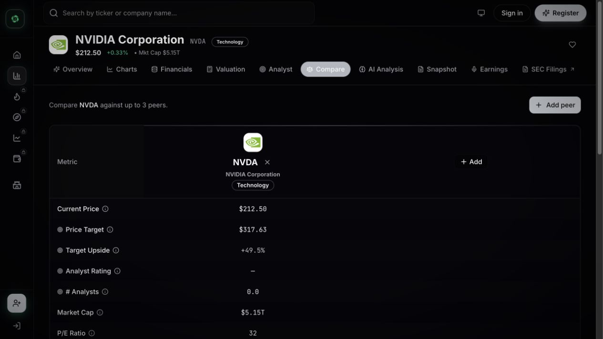

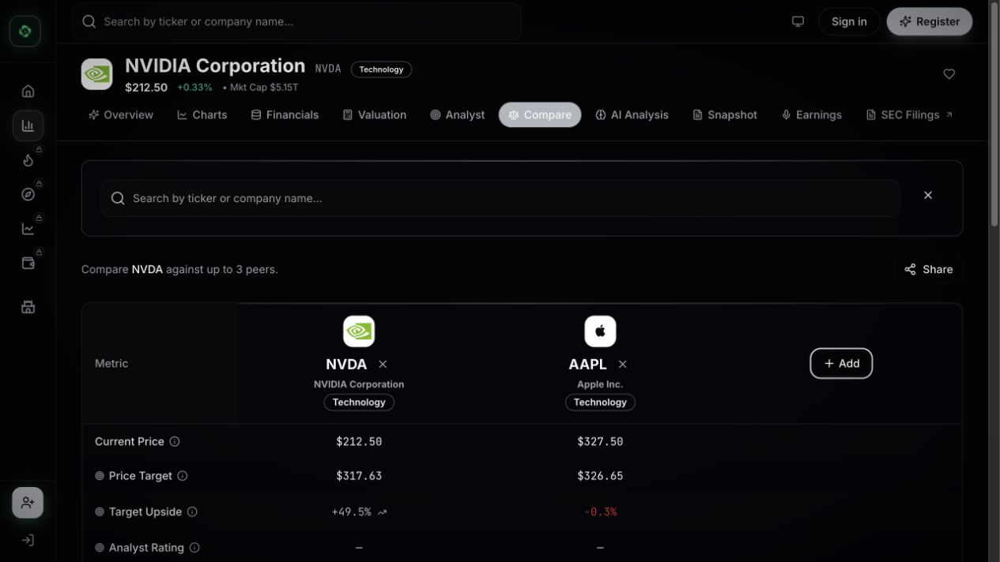

### 2. Comparison layout and metrics

Stocks are columns and metrics are rows:

- Current Price
- Price Target
- Target Upside
- Analyst Rating
- Number of Analysts
- Market Cap
- P/E
- P/S
- FCF Margin
- 3Y Revenue CAGR
- 5Y Revenue CAGR
- Dividend Yield
- Revenue TTM
- Net Income TTM
- FCF TTM

A legend explains whether higher, lower, or stronger analyst sentiment is considered preferable. Best-in-row emphasis makes the table scannable without hiding the raw values.

## AI Analysis

### Public state

- The tab loaded two otherwise empty iframe regions behind a premium lock card.
- The visible product description identifies a multi-page AI deep dive and SWOT-style analysis covering strengths, weaknesses, opportunities, and threats.
- The actual report, report section headings, generation duration, loading sequence, prompt/customization controls, and regeneration options were not observable without starting a trial. They are not inferred here.

## Snapshot

### Public state and usage dialog

- The outer page presents a locked one-page AI infographic intended to condense bull case, bear case, key risks, and valuation read.
- The embedded dialog reported `5/5 free uses consumed` after the interaction audit and offered a trial.
- The feature comparison listed these metered categories at five free uses versus unlimited subscription use: Valuation Models, AI Analysis & Reports, Financial Charts, Technical Signals, and Stock Comparisons.
- Watchlist & Alerts, Community & Feed, and Opportunity Matrix also appear in the comparison, but the observed layout did not expose enough semantics to assign exact per-plan limits beyond their presence.
- The dialog has a close control. Snapshot generation time, regeneration, and export behavior were not observable in the exhausted anonymous state.

## Earnings

### Public state

- Embedded transcript shell titled **Earnings Transcripts**.
- Company identity plus an **Available Transcripts** selector/list.
- Empty state asks the user to select a transcript to view.
- An outer lock card describes quarter-by-quarter call summaries, guidance changes, and earnings-surprise drivers.
- Transcript selection, search, playback/reading tools, and summary structure were pointer-blocked and could not be verified without the trial.

## SEC Filings

This tab is an external link, not an in-app filing reader. It opened the SEC's classic EDGAR company page filtered to NVIDIA's CIK, form `10-K`, ownership included, and 40 results per page.

### SEC destination inventory

- Company identity, addresses, CIK, SIC, state of incorporation, and fiscal-year end.
- Filters: filing type, prior-to date, ownership inclusion, and result count.
- **Search**, **Show All**, keyword search, and RSS.
- Results table: filing type, Documents, Interactive Data, description/accession metadata, file size, filing date, and film number.
- The observed filter returned 31 results; the latest listed filing was dated 2026-02-25.

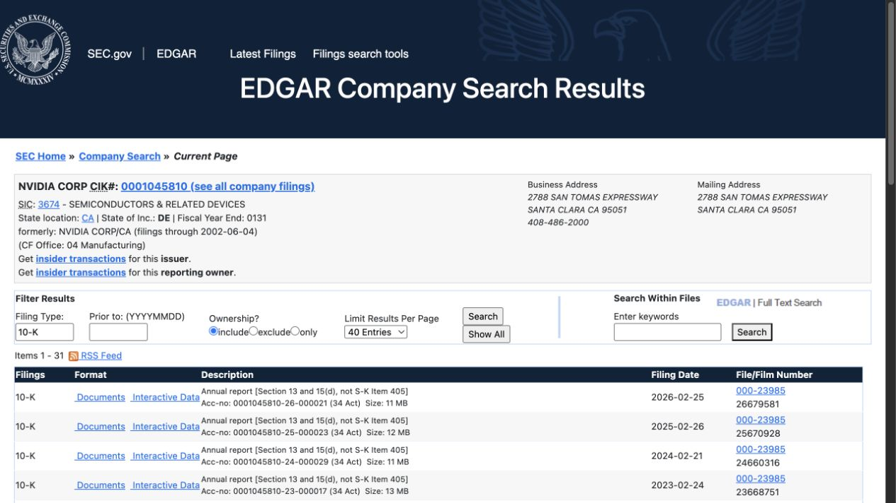

## Sidebar destinations

### Value Analyzer

The `/analyzer` destination redirected to the last selected stock route (`/stock/NVDA`) in the anonymous session. In practice it behaves as the entry/search funnel for the stock analysis workspace rather than a separate public dashboard.

### Technical Signals

The `/direction` destination opened a members-only modal with trial/sign-in actions. No public signal dashboard, metric inventory, or interaction was exposed, so the underlying features were not inferred.

### Stock Ideas

The `/discovery` destination also opened a members-only modal. It appears to be the discovery/idea funnel, but the idea feed and filters were not publicly observable.

### Market Briefs

The sidebar `/briefs` destination opened the same members-only pattern. A separate footer link to `/market-briefs` returned 404, indicating inconsistent route wiring between the sidebar and footer.

## Free-versus-paid boundary map

| Surface | Public behavior | Locked/gated behavior |
| --- | --- | --- |
| Overview | price history through 1Y, verdict, valuation snapshot, key financials, cases, matrix | 5Y/10Y price history routes to annual checkout |
| Charts | selected chart library, hovers, About, expanded chart | 30+ advanced charts and Chart Builder composition/export |
| Financials | Quick Insights and visible table structure | full 30+ year statements blurred and pointer-blocked |
| Valuation | all four model shells, editable assumptions, projections, sensitivity, aggregate | anonymous usage meter; save/history/notes require sign-in; unlimited use paid |
| Analyst | public target, estimates, ratings, changes/actions | no additional lock observed |
| Compare | up to three peer slots and metric table | category appears in five-use meter; exact trigger not isolated |
| AI Analysis | product-level description only | report content and generation UX hidden behind trial |
| Snapshot | product-level description and usage dialog | infographic generation unavailable after 5/5 uses |
| Earnings | transcript selector shell and empty state | transcript content/summaries pointer-blocked |
| SEC Filings | external SEC results are public | no site-side premium layer |
| Watchlist | heart and explanatory sign-in toast | persistence requires sign-in |

## Summary

### Feature-group count by tab

Counts below use the top-to-bottom groups documented above, not every repeated card or every metric row.

| Tab | Distinct feature groups | Main groups counted |
| --- | ---: | --- |
| Overview | 8 | price history, verdict, valuation, key financials, mini-charts, cases, matrix, profile/links |
| Charts | 7 | header controls, categories, essential grid, category grid, card actions, builder, premium boundary |
| Financials | 4 | Quick Insights, statement controls, statement fields, premium boundary |
| Valuation | 6 | aggregate selector, DCF, EPS, Rule of 40, PEG, persistence/gating |
| Analyst | 5 | target range, estimates, rating distribution, target changes, analyst actions |
| Compare | 2 | peer-add flow, metric comparison table |
| AI Analysis | 1 | locked report surface |
| Snapshot | 1 | locked infographic plus usage dialog |
| Earnings | 1 | locked transcript surface |
| SEC Filings | 1 | external filing-search destination |
| **Total** | **36** | top-level feature groups across all tabs |

### Five strongest UX details

1. **Progressive depth:** the Overview gives a fast thesis, then links into charts, statements, valuation models, peers, and source filings.
2. **Valuation assumptions remain inspectable:** model inputs, historical shortcuts, live outputs, and sensitivity cells keep the conclusion auditable instead of presenting a single opaque target.
3. **Chart education is in context:** each metric can explain its definition, calculation, interpretation, and limitations without leaving the chart.
4. **Interactions update the decision surface immediately:** range selection, frequency, presets, sliders, peer additions, and Opportunity Matrix choices all produce visible local feedback.
5. **Responsive containment is disciplined:** a dense analysis page stacks cleanly at mobile width without document-level horizontal overflow; only the tab rail scrolls intentionally.

### Unexpected findings and product cautions

- The anonymous allowance was consumed by interaction testing even without account creation; metering should always identify which action spends a use before the user triggers it.
- “10Y” remained selected while disabled after switching charts to Quarterly, a small but confusing state mismatch.
- Profitability exposed duplicate ROIC/ROE/ROA concepts in the rendered structure; unique chart counts should be validated before copying taxonomy.
- The SEC experience leaves the app entirely. A future Rushd implementation could preserve provenance while providing an in-app filing index and then link to the original filing.
- `/briefs` is gated while the footer's `/market-briefs` route is broken; navigation aliases should share one source of truth.
- Several premium tabs render empty iframes beneath lock cards. A purpose-built preview state would communicate value more clearly and avoid the appearance of failed content.
- The price-target DOM ordering was not fully unambiguous. Rushd should bind labels and values semantically and expose the same relationship to assistive technology.

### Rushd implementation takeaways

- Reuse the progressive information hierarchy, but preserve Rushd's own visual system, Sharia framing, bilingual parity, and explicit data provenance.
- Separate observed market facts, model assumptions, user inputs, and generated interpretation with clear labels.
- Never fabricate inaccessible report sections. Product parity should be based only on the public behavior inventoried here or on separately authorized trial evidence.
- Show usage cost before an analysis runs, and keep mock/no-key states useful rather than replacing content with a blank lock surface.
- Prefer an in-app source trail for SEC filings and market data so users can audit the evidence without losing their place.
