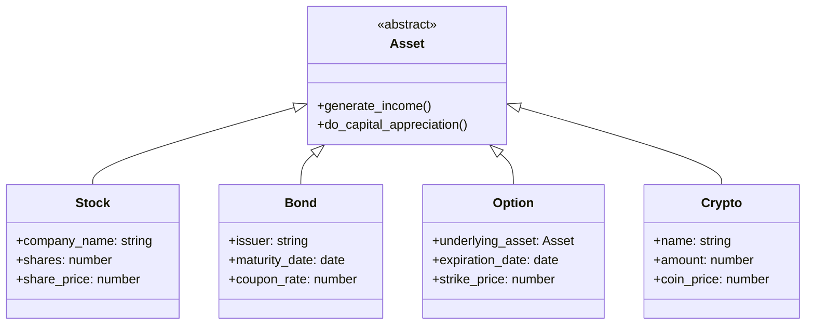
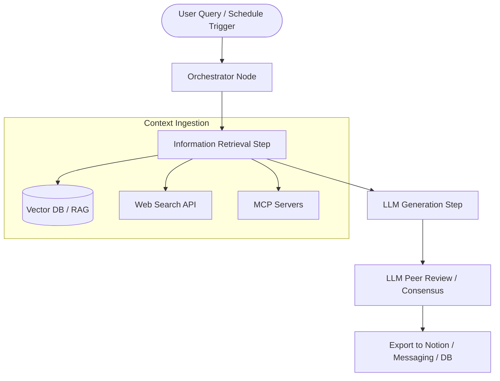

# Investing for Programmers: Quantitative Analysis, Algorithmic Trading & AI Agents

> **Source Book**: *Investing for Programmers* by Stefan Papp (Manning MEAP)
> **Target Audience**: AI Agents (Claude Code, Antigravity, Gemini), Quantitative Engineers, and Financial Developers.
> **Scope**: Chapters 1 through 13 complete reference (Theory, Math, Data Schemas, Code Patterns, Risk Frameworks, Agentic Architectures).

---

## Table of Contents
1. [Chapter 1: Investing Smart](#chapter-1-investing-smart)
2. [Chapter 2: Investment Essentials](#chapter-2-investment-essentials)
3. [Chapter 3: Collecting Data](#chapter-3-collecting-data)
4. [Chapter 4: Growth Portfolios](#chapter-4-growth-portfolios)
5. [Chapter 5: Income Portfolios](#chapter-5-income-portfolios)
6. [Chapter 6: Building an Asset Monitor](#chapter-6-building-an-asset-monitor)
7. [Chapter 7: Risk Management](#chapter-7-risk-management)
8. [Chapter 8: AI for Financial Research](#chapter-8-ai-for-financial-research)
9. [Chapter 9: AI Agents](#chapter-9-ai-agents)
10. [Chapter 10: Charts & Technical Analysis](#chapter-10-charts--technical-analysis)
11. [Chapter 11: Algorithmic Trading](#chapter-11-algorithmic-trading)
12. [Chapter 12: Private Equity & Startup Investing](#chapter-12-private-equity--startup-investing)
13. [Chapter 13: Principles & Final Guidance](#chapter-13-principles--final-guidance)

---

## Chapter 1: Investing Smart

### 1.1 Core Concepts
* **Definition of Investment**: An asset acquired with the primary objective of generating **income** (cash flow) or **capital appreciation** (asset value growth).
* **Asset Model (Object-Oriented Hierarchy)**:
  * Abstract base class: `Asset` (`generate_income()`, `do_capital_appreciation()`).
  * Concrete implementations: `Stock`, `Bond`, `Option`, `Crypto`, `RealEstate`, `Art`.



### 1.2 Investor Performance Benchmarks (Historical Context)
| Investor | Key Fund / Vehicle | Period | Annualized Returns | Approach / Primary Edge |
| :--- | :--- | :--- | :--- | :--- |
| **Jim Simons** | Medallion Fund (RenTech) | 1998–2018 | **39.1%** | Quantitative / Mathematical ML Models |
| **George Soros** | Quantum Fund | 1969–2000 | **32.0%** | Macro / Reflexivity / Contrarian |
| **Steven Cohen** | SAC Capital | 1992–2003 | **30.0%** | High-Frequency & Tactical Trading |
| **Peter Lynch** | Magellan Fund (Fidelity) | 1977–1990 | **29.0%** | Growth at Reasonable Price (GARP) & Domain Knowledge |
| **Warren Buffett** | Berkshire Hathaway | 1965–2018 | **20.5%** | Value Investing, Moats & Long compounding |
| **Ray Dalio** | Pure Alpha (Bridgewater) | 1991–2018 | **12.0%** | Systematic Macro Risk Parity |

### 1.3 Programmer Traits as Investors
1. **Abstract Thinking**: Capability to model immaterial financial instruments and derivative structures cleanly.
2. **Failure Anticipation / Edge-Case Handling**: Predicting black-swan events and systemic failure modes early.
3. **Resilience & Debugging Mindset**: Disciplined adherence to rules during drawdowns (delayed gratification).
4. **Domain Expertise**: Firsthand observation of technological paradigm shifts (e.g., Cloud, AI hardware, SaaS).

---

## Chapter 2: Investment Essentials

### 2.1 The Three Core Financial Statements
1. **Income Statement**: Performance over a period ($Q1..Q4$, Annual).
   $$\text{Net Income} = \text{Revenue} - \text{Expenses}$$
2. **Balance Sheet**: Snapshot of financial condition at a point in time.
   $$\text{Assets} = \text{Liabilities} + \text{Shareholders' Equity}$$
3. **Cash Flow Statement**: Actual liquidity generated across Operations, Investing, and Financing.
   $$\text{Free Cash Flow (FCF)} = \text{Operating Cash Flow} - \text{Capital Expenditures (CapEx)}$$

### 2.2 Global Industry Classification Standard (GICS)
GICS categorizes companies across 4 hierarchical levels: **11 Sectors**, **25 Industry Groups**, **74 Industries**, and **163 Sub-Industries**.

| Sector | Core Business | Primary Market Drivers & Sensitivity |
| :--- | :--- | :--- |
| **Utilities** | Electricity, water, natural gas | Interest rates, energy prices, regulation, bond yields |
| **Consumer Staples** | Food, beverages, household items | Inflation, consumer confidence, raw material costs (Defensive) |
| **Consumer Discretionary** | Autos, luxury, apparel, leisure | Disposable income, unemployment rates (Cyclical) |
| **Communication Services** | Telecom, media, entertainment | Regulation, tech shifts, ad spending |
| **Real Estate** | Property development, REITs | Interest rates, demographics, economic cycles |
| **Information Technology** | Software, hardware, semiconductors | Innovation, R&D productivity, capex cycles |
| **Energy** | Oil & gas extraction, refining, fuels | Geopolitics, oil prices, green transition |
| **Health Care** | Pharmaceuticals, biotech, medical tech | Regulation, drug pricing, demographic shifts |
| **Financials** | Banking, insurance, asset management | Yield curve, credit default rates, monetary policy |
| **Industrials** | Construction, aerospace, machinery | Global trade, manufacturing output |
| **Materials** | Chemicals, mining, metals | Commodity supply-demand, environmental laws |

### 2.3 Key Financial Metrics & Formulas

#### Liquidity Ratios
$$\text{Current Ratio} = \frac{\text{Current Assets}}{\text{Current Liabilities}}$$
$$\text{Quick Ratio} = \frac{\text{Cash} + \text{Marketable Securities} + \text{Receivables}}{\text{Current Liabilities}}$$

#### Leverage & Debt Ratios
$$\text{Debt-to-Equity (D/E)} = \frac{\text{Total Liabilities}}{\text{Shareholders' Equity}}$$
$$\text{Interest Coverage Ratio} = \frac{\text{EBIT}}{\text{Interest Expenses}} \quad (\text{Red flag if } < 1.0)$$

#### Profitability & Valuation Ratios
$$\text{Earnings Per Share (EPS)} = \frac{\text{Net Income} - \text{Preferred Dividends}}{\text{Shares Outstanding}}$$
$$\text{Price-to-Earnings (P/E)} = \frac{\text{Share Price}}{\text{EPS}}$$
$$\text{PEG Ratio} = \frac{\text{P/E}}{\text{Annual EPS Growth Rate}} \quad (\text{Value opportunity if } < 1.0)$$
$$\text{Return on Assets (ROA)} = \frac{\text{Net Income}}{\text{Total Assets}} \times 100\%$$
$$\text{Return on Equity (ROE)} = \frac{\text{Net Income}}{\text{Shareholders' Equity}} \times 100\%$$

---

## Chapter 3: Collecting Data

### 3.1 Return Definitions

#### Simple Returns
$$R_{\text{simple}, t} = \frac{P_t - P_{t-1}}{P_{t-1}} = \frac{P_t}{P_{t-1}} - 1$$

#### Logarithmic (Continuous Compounded) Returns
$$R_{\text{log}, t} = \ln\left(\frac{P_t}{P_{t-1}}\right) = \ln(P_t) - \ln(P_{t-1})$$

*Property*: Logarithmic returns are time-additive:
$$\sum_{t=1}^k R_{\text{log}, t} = \ln\left(\frac{P_k}{P_0}\right)$$

### 3.2 Python Data Extraction Patterns

```python
import numpy as np
import pandas as pd
import yfinance as yf

# 1. Fundamental Financial Ratios Extraction
def collect_ratios(tickers: list[str], ratios: list[str]) -> pd.DataFrame:
    rows = []
    for ticker in tickers:
        info = yf.Ticker(ticker).info
        row = [ticker] + [info.get(r, None) for r in ratios]
        rows.append(row)
    return pd.DataFrame(rows, columns=["Ticker"] + ratios)

# Example Usage
df_ratios = collect_ratios(
    ["WMT", "MO", "NVDA", "CRM"],
    ["sector", "industry", "currentRatio", "quickRatio", "debtToEquity", "pegRatio"]
)

# 2. Daily Log Returns Calculation
def get_log_returns(tickers: list[str], start: str, end: str) -> pd.DataFrame:
    data = yf.download(tickers, start=start, end=end)["Adj Close"]
    log_returns = data.apply(lambda x: np.log(x / x.shift(1))).dropna()
    return log_returns
```

---

## Chapter 4: Growth Portfolios

### 4.1 Systematic Thesis Development Process
1. **Domain Selection**: Focus strictly on industries within the investor's circle of competence.
2. **Market Sizing**: Validate total market CAGR and addressable market growth.
3. **Sub-Thesis Formulation**: Identify catalysts (e.g., shift to solid-state LiDAR, sensor demand in autonomous fleets).
4. **Candidate Screening**: Gather candidates by ticker (e.g., LAZR, INVZ, OUST, AEVA).
5. **Divergence & Risk Verification**: Check burn rate, debt-to-equity ratio, and market competition (e.g., Tesla Vision pure-camera approach vs. LiDAR).
6. **Sentiment & Trend Screening**: Monitor Google Trends (`pytrends`) and news sentiment using Alpha Vantage REST APIs.

```python
from pytrends.request import TrendReq
import pandas as pd

# Fetching search interest over time for growth candidates
def fetch_google_trends(keywords: list[str]) -> pd.DataFrame:
    pytrend = TrendReq(hl="en-US", tz=360)
    pytrend.build_payload(keywords, cat=0, timeframe="today 12-m", geo="", gprop="")
    df_trends = pytrend.interest_over_time()
    return df_trends
```

---

## Chapter 5: Income Portfolios

### 5.1 Dividend Mechanics & BCG Matrix Position
* **Cash Cows**: High market share, low growth rate. Ideal dividend payers.
* **Compound Annual Dividend Growth (CAGR)**:
  $$\text{CAGR}_{\text{div}} = \left(\frac{\text{Div}_{\text{last}}}{\text{Div}_{\text{first}}}\right)^{\frac{1}{N}} - 1$$

```python
import pandas as pd
import yfinance as yf

def calculate_dividend_growth(ticker: str) -> tuple[float | None, str]:
    stock = yf.Ticker(ticker)
    dividends = stock.dividends
    if dividends.empty:
        return None, "None"
    
    yearly_divs = dividends.resample("YE").sum()
    if len(yearly_divs) > 1:
        first_div = yearly_divs.iloc[0]
        last_div = yearly_divs.iloc[-1]
        n_years = yearly_divs.index[-1].year - yearly_divs.index[0].year
        cagr = ((last_div / first_div) ** (1 / n_years)) - 1 if n_years > 0 else None
    else:
        cagr = None
        
    payouts_per_year = dividends.resample("YE").count().mean()
    if payouts_per_year > 3.5:
        freq = "Quarterly"
    elif payouts_per_year > 1.5:
        freq = "Semi-Annual"
    elif payouts_per_year > 0.5:
        freq = "Annual"
    else:
        freq = "Irregular"
        
    return cagr, freq
```

### 5.2 Fixed Income & Credit Ratings
* **U.S. Treasury Durations**:
  * **T-Bills**: Maturity $\le 1$ year (Zero-coupon).
  * **T-Notes**: Maturity 2 to 10 years.
  * **T-Bonds**: Maturity $> 10$ years up to 30 years.
* **Rating Agency Tiers**:

| Tier | Moody's | S&P / Fitch | Credit Risk Profile |
| :--- | :--- | :--- | :--- |
| **Investment Grade** | Aaa to Baa3 | AAA to BBB- | Low to moderate default risk |
| **Speculative Grade (High Yield / Junk)** | Ba1 to Caa3 | BB+ to CCC- | High default probability, substantial vulnerability |
| **Default** | Ca / C | CC / D | In default / non-payment |

---

## Chapter 6: Building an Asset Monitor

### 6.1 Unified Multi-Broker Data Pipeline
1. **Raw Ingestion**: Read position feeds from Alpaca REST API, Interactive Brokers (`ib_insync`), and SQLite (`offline_asset`).
2. **Ticker Normalization**: Map broker symbols to Yahoo/Google ticker conventions using an `asset_lookup` table.
3. **Currency Conversion**: Convert multi-currency holdings into standard base currency (USD) using `CurrencyConverter`.
4. **Spreadsheet Sync**: Update live cell formulas (e.g., `=GOOGLEFINANCE("NASDAQ:AAPL")`) and summary sheets via `gspread`.

```sql
-- SQLite Lookup Schema
CREATE TABLE main.asset_lookup (
    ticker TEXT NOT NULL PRIMARY KEY,
    asset_type TEXT NOT NULL,
    portfolio TEXT,
    yahoo TEXT,
    google TEXT
);
```

---

## Chapter 7: Risk Management

### 7.1 Risk Metrics & Portfolio Optimization

#### Value at Risk (VaR) via Monte Carlo Simulation
Simulates $N$ potential price outcomes assuming normal or historical return distributions:

$$P_{\text{simulated}} = P_{\text{last}} \times \left(1 + \mathcal{N}(\mu, \sigma)\right)$$
$$\text{VaR}_{95\%} = \text{Percentile}\left(P_{\text{simulated}} - P_{\text{last}}, 5\%\right)$$

```python
import numpy as np
import pandas as pd
import yfinance as yf

def calculate_monte_carlo_var(ticker: str, confidence_level: float = 0.95, num_sims: int = 10000) -> float:
    stock = yf.Ticker(ticker)
    hist = stock.history(period="1y")["Close"]
    returns = hist.pct_change().dropna()
    
    mu = returns.mean()
    sigma = returns.std()
    last_price = hist.iloc[-1]
    
    simulated_returns = np.random.normal(mu, sigma, num_sims)
    simulated_prices = last_price * (1 + simulated_returns)
    price_diffs = simulated_prices - last_price
    
    var_threshold = np.percentile(price_diffs, (1 - confidence_level) * 100)
    return float(-var_threshold)
```

#### Markowitz Efficient Frontier & Sharpe Ratio Optimization
Given portfolio weights vector $w$, expected return vector $\mu$, and covariance matrix $\Sigma$:

$$\text{Expected Return } R_p = w^T \mu \times 252$$
$$\text{Portfolio Volatility } \sigma_p = \sqrt{w^T \Sigma w \times 252}$$
$$\text{Sharpe Ratio } SR = \frac{R_p - R_f}{\sigma_p}$$

```python
import numpy as np
import pandas as pd

def optimize_markowitz_portfolio(returns_df: pd.DataFrame, risk_free_rate: float = 0.0422, num_portfolios: int = 10000):
    trading_days = 252
    mean_returns = returns_df.mean() * trading_days
    cov_matrix = returns_df.cov() * trading_days
    
    num_assets = len(returns_df.columns)
    results = np.zeros((3 + num_assets, num_portfolios))
    
    for i in range(num_portfolios):
        weights = np.random.dirichlet(np.ones(num_assets))
        p_ret = np.dot(weights, mean_returns)
        p_vol = np.sqrt(np.dot(weights.T, np.dot(cov_matrix, weights)))
        sharpe = (p_ret - risk_free_rate) / p_vol
        
        results[0, i] = p_ret
        results[1, i] = p_vol
        results[2, i] = sharpe
        results[3:, i] = weights
        
    max_sharpe_idx = np.argmax(results[2])
    optimal_weights = results[3:, max_sharpe_idx]
    
    weights_dict = {col: optimal_weights[idx] for idx, col in enumerate(returns_df.columns)}
    return weights_dict, results[2, max_sharpe_idx]
```

---

## Chapter 8: AI for Financial Research

### 8.1 Unsupervised Clustering of Financial Assets (K-Means)
Using Annualized Returns & Volatility to group stocks without pre-existing labels:

```python
import numpy as np
import pandas as pd
from sklearn.cluster import KMeans

def cluster_stocks_by_risk_return(returns_series: pd.Series, vol_series: pd.Series, k: int = 5) -> pd.DataFrame:
    data = np.column_stack((returns_series.values, vol_series.values))
    kmeans = KMeans(n_clusters=k, random_state=42).fit(data)
    
    df_clusters = pd.DataFrame({
        "Ticker": returns_series.index,
        "Returns": returns_series.values,
        "Volatility": vol_series.values,
        "Cluster": kmeans.labels_
    })
    return df_clusters
```

---

## Chapter 9: AI Agents

### 9.1 The Four Agentic Design Patterns (DeepLearning.ai)
1. **Reflection**: Agent self-evaluates outputs against goals and iteratively corrects responses.
2. **Tool Use**: Autonomous selection and invocation of external tools (REST APIs, Python tools, SQL databases).
3. **Planning**: Multi-step decomposition of complex tasks into an executable DAG (Directed Acyclic Graph).
4. **Multi-Agent Collaboration**: Specialized roles (e.g., Bull Analyst vs Bear Analyst vs PM Moderator) debating to form consensus.

### 9.2 Reference RAG + LangGraph Execution Architecture



### 9.3 LangGraph Execution Graph (Code Pattern)

```python
from typing import TypedDict, List
from langchain_core.documents import Document
from langgraph.graph import StateGraph, START

class AgentState(TypedDict):
    question: str
    context: List[Document]
    answer: str

def retrieve_step(state: AgentState):
    # Simulated vector retrieval
    return {"context": [Document(page_content="Context data...")]}

def generate_step(state: AgentState):
    context_text = "\n\n".join(doc.page_content for doc in state["context"])
    # LLM generation call using prompt + context_text
    return {"answer": f"Generated answer based on: {context_text}"}

builder = StateGraph(AgentState)
builder.add_node("retrieve", retrieve_step)
builder.add_node("generate", generate_step)

builder.add_edge(START, "retrieve")
builder.add_edge("retrieve", "generate")

graph = builder.compile()
```

---

## Chapter 10: Charts & Technical Analysis

### 10.1 Key Technical Indicators & Formulas

#### Moving Averages
* **Simple Moving Average (SMA)**:
  $$SMA_k(t) = \frac{1}{k} \sum_{i=0}^{k-1} P_{t-i}$$

* **Exponential Moving Average (EMA)**:
  $$EMA_t = P_t \cdot \left(\frac{2}{k+1}\right) + EMA_{t-1} \cdot \left(1 - \frac{2}{k+1}\right)$$

* **Hull Moving Average (HMA)**:
  $$HMA_k = WMA_{\lfloor\sqrt{k}\rfloor}\left(2 \cdot WMA_{\lfloor k/2 \rfloor}(P) - WMA_k(P)\right)$$

#### Bollinger Bands
$$\text{Middle Band} = SMA_{20}(P)$$
$$\text{Upper Band} = SMA_{20}(P) + 2 \cdot \sigma_{20}(P)$$
$$\text{Lower Band} = SMA_{20}(P) - 2 \cdot \sigma_{20}(P)$$

#### MACD (Moving Average Convergence Divergence)
$$\text{MACD Line} = EMA_{12}(P) - EMA_{26}(P)$$
$$\text{Signal Line} = EMA_9(\text{MACD Line})$$
$$\text{Histogram} = \text{MACD Line} - \text{Signal Line}$$

#### Ichimoku Cloud (Kumo)
* **Conversion Line (Tenkan-sen)**: $\frac{\max_{9}(H) + \min_{9}(L)}{2}$
* **Base Line (Kijun-sen)**: $\frac{\max_{26}(H) + \min_{26}(L)}{2}$
* **Leading Span A (Senkou Span A)**: $\frac{\text{Conversion} + \text{Base}}{2}$ (Plotted 26 periods ahead)
* **Leading Span B (Senkou Span B)**: $\frac{\max_{52}(H) + \min_{52}(L)}{2}$ (Plotted 26 periods ahead)
* **Lagging Span (Chikou Span)**: Close price plotted 26 periods behind.

---

## Chapter 11: Algorithmic Trading

### 11.1 SMA Crossover Backtesting Engine

```python
import pandas as pd
import numpy as np

def run_sma_crossover_backtest(df: pd.DataFrame, lower: int, upper: int, initial_cash: float = 1000.0) -> pd.DataFrame:
    data = df.copy()
    data[f"sma_{lower}"] = data["Close"].rolling(window=lower).mean()
    data[f"sma_{upper}"] = data["Close"].rolling(window=upper).mean()
    
    shares = round(initial_cash / data["Close"].iloc[0])
    waiting_for_sell = False
    records = []
    
    for idx, row in data.iterrows():
        l_val = row[f"sma_{lower}"]
        u_val = row[f"sma_{upper}"]
        
        if pd.isna(l_val) or pd.isna(u_val):
            continue
            
        if not waiting_for_sell and l_val > u_val:
            records.append({"date": idx, "action": "BUY", "price": row["Close"], "value": row["Close"] * shares})
            waiting_for_sell = True
        elif waiting_for_sell and l_val < u_val:
            records.append({"date": idx, "action": "SELL", "price": row["Close"], "value": row["Close"] * shares})
            waiting_for_sell = False
            
    return pd.DataFrame(records)
```

### 11.2 Order Modalities & Types
* **Market Order**: Immediate execution at prevailing ask/bid.
* **Limit Order**: Executes only at specified price or better (`price <= limit_price`).
* **Stop Order**: Triggers a market order once price crosses stop threshold (`price <= stop_price`).
* **Stop-Limit Order**: Triggers a limit order when stop price is breached.
* **Trailing Stop**: Dynamic stop price that rises with peak price advances by a fixed offset/percentage.
* **Modalities**:
  * **FOK (Fill or Kill)**: Immediate full execution or entire order cancelled.
  * **GTC (Good 'til Canceled)**: Order remains active until filled or explicitly cancelled.

---

## Chapter 12: Private Equity & Startup Investing

### 12.1 Startup Funding Stages
1. **Pre-Seed**: MVP validation, funded by founders/friends/family.
2. **Seed**: Validation of TAM/SAM/SOM, early product-market fit (PMF), incubators/accelerators.
3. **Series A**: Business model scaling, customer acquisition velocity.
4. **Series B**: Operational scaling, expansion into international markets.
5. **Series C+**: Market dominance, M&A, preparation for public IPO or strategic buyout.

### 12.2 Startup Equity Dilution Formula & Code

$$S_{\text{new}} = S_{\text{existing}} \times \left(\frac{\text{Equity Given \%}}{100 - \text{Equity Given \%}}\right)$$

```python
import pandas as pd

def simulate_equity_dilution(initial_shares: int, rounds: list[tuple[str, float, float]]) -> pd.DataFrame:
    total_shares = initial_shares
    founder_shares = initial_shares
    records = []
    
    for round_name, capital_raised, equity_given_pct in rounds:
        new_shares = total_shares * (equity_given_pct / (100 - equity_given_pct))
        total_shares += new_shares
        founder_pct = (founder_shares / total_shares) * 100.0
        records.append({
            "Round": round_name,
            "Investment ($)": capital_raised,
            "Total Shares": int(total_shares),
            "Founder Ownership (%)": round(founder_pct, 2)
        })
        
    return pd.DataFrame(records)

# Example: 1M initial shares, Seed (25%), Series A (20%), Series B (15%), Series C (10%)
rounds_data = [
    ("Seed", 500000, 25.0),
    ("Series A", 2000000, 20.0),
    ("Series B", 10000000, 15.0),
    ("Series C", 50000000, 10.0),
]
df_dilution = simulate_equity_dilution(1000000, rounds_data)
```

---

## Chapter 13: Principles & Final Guidance

1. **Circle of Competence**: Invest exclusively in businesses and technological domains you deeply understand.
2. **Shiller 80/20 Rule**: Core-satellite structure allocating 80% to low-cost indexed broad market funds and 20% to active stock/strategy selection.
3. **Checks & Balances**: Maintain an explicit **Investment Diary** documenting thesis, stop-loss triggers, and post-trade retrospectives to remove emotional bias.
